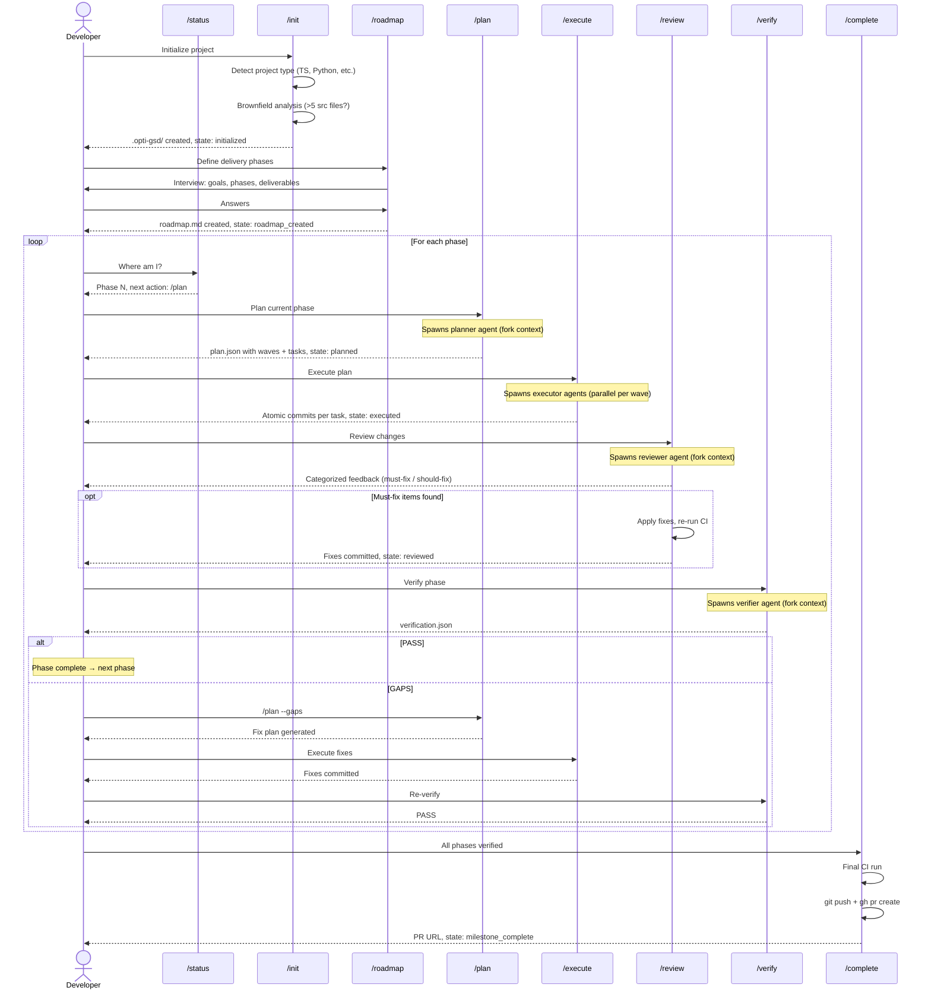
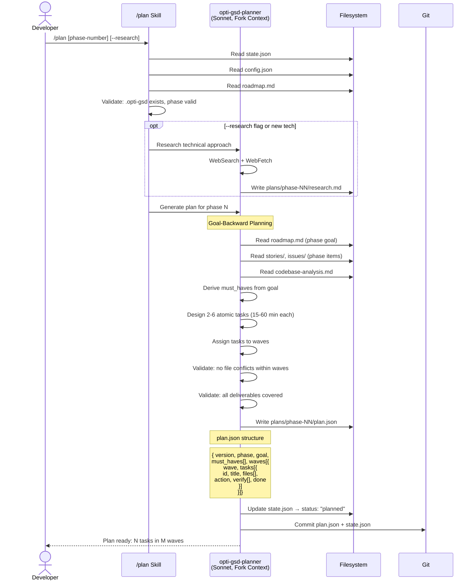
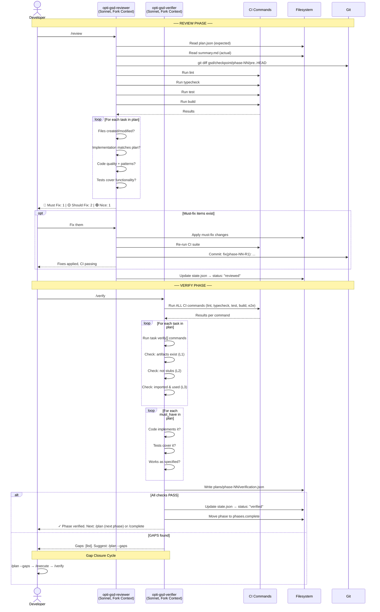
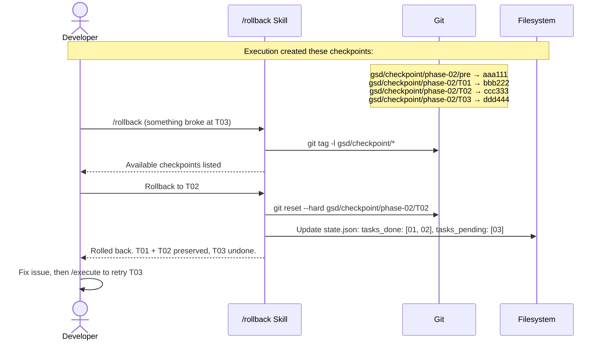
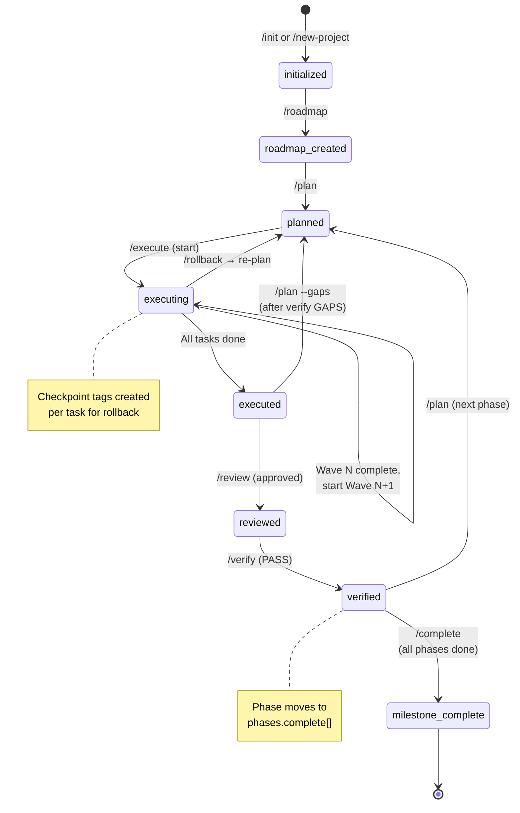

# opti-gsd Sequence Diagrams

## 1. Full Lifecycle — High Level

## 2. Plan Phase — Planner Agent Detail

## 3. Execute Phase — Wave-Based Parallelism

```mermaid
sequenceDiagram
    actor Dev as Developer
    participant SK as /execute Skill
    participant Git as Git
    participant EX1 as Executor T01<br/>(Sonnet, Task)
    participant EX2 as Executor T02<br/>(Sonnet, Task)
    participant EX3 as Executor T03<br/>(Sonnet, Task)
    participant FS as Filesystem

    Dev->>SK: /execute [interactive|autonomous]
    SK->>FS: Read plan.json
    SK->>Git: Check for uncommitted changes

    Note over SK,Git: Pre-Execution Checkpoint
    SK->>Git: Tag: gsd/checkpoint/phase-NN/pre

    rect rgb(40, 60, 90)
        Note over EX1,EX2: ── Wave 1 (parallel, no dependencies) ──
        par Task 01
            SK->>EX1: Spawn executor with task JSON
            EX1->>FS: Read existing code (patterns)
            EX1->>EX1: Implement per instructions
            EX1->>EX1: Run verify[] commands
            alt Verify passes
                EX1->>Git: Atomic commit: feat(phase-NN-T01): ...
                EX1-->>SK: Commit: abc123
            else Verify fails (retry ≤3)
                EX1->>EX1: Fix and retry
                EX1->>Git: Atomic commit
                EX1-->>SK: Commit: abc123
            end
        and Task 02
            SK->>EX2: Spawn executor with task JSON
            EX2->>FS: Read existing code
            EX2->>EX2: Implement per instructions
            EX2->>EX2: Run verify[] commands
            EX2->>Git: Atomic commit: feat(phase-NN-T02): ...
            EX2-->>SK: Commit: def456
        end

        SK->>Git: Tag: gsd/checkpoint/phase-NN/T01 → abc123
        SK->>Git: Tag: gsd/checkpoint/phase-NN/T02 → def456
        SK->>FS: Update state.json: tasks_done += [01, 02]
    end

    opt Interactive mode
        SK-->>Dev: Wave 1 complete. Continue / Review / Stop?
        Dev->>SK: Continue
    end

    rect rgb(40, 80, 60)
        Note over EX3: ── Wave 2 (depends on Wave 1) ──
        SK->>EX3: Spawn executor with task JSON
        EX3->>FS: Read code (including Wave 1 output)
        EX3->>EX3: Implement per instructions
        EX3->>EX3: Run verify[] commands
        EX3->>Git: Atomic commit: feat(phase-NN-T03): ...
        EX3-->>SK: Commit: ghi789
        SK->>Git: Tag: gsd/checkpoint/phase-NN/T03 → ghi789
    end

    SK->>FS: Write plans/phase-NN/summary.md
    SK->>FS: Update state.json → status: "executed"
    SK-->>Dev: All tasks complete. Suggest: /review
```

## 4. Review + Verify Cycle

## 5. Checkpoint & Recovery

## 6. State Machine

## 7. Full Agent Interaction Map

```mermaid
sequenceDiagram
    actor Dev as Developer
    participant Main as Claude Code<br/>(Main Context)
    participant Plan as Planner Agent<br/>(Fork Context)
    participant Ex as Executor Agent(s)<br/>(Task Context × N)
    participant Rev as Reviewer Agent<br/>(Fork Context)
    participant Ver as Verifier Agent<br/>(Fork Context)
    participant Res as Researcher Agent<br/>(Fork Context)

    Note over Dev,Res: Each agent gets FRESH context (200k tokens)

    Dev->>Main: /plan
    Main->>Plan: Spawn (fork) with phase goal + codebase
    Plan-->>Main: plan.json (waves + tasks)
    Note over Main: Plan agent context released

    Dev->>Main: /execute
    rect rgb(40, 60, 90)
        Note over Ex: Wave 1 — parallel executors
        par
            Main->>Ex: Task T01 (spawn via Task tool)
        and
            Main->>Ex: Task T02 (spawn via Task tool)
        end
        Ex-->>Main: Commit hashes
        Note over Main: All executor contexts released
    end

    rect rgb(40, 80, 60)
        Note over Ex: Wave 2 — depends on Wave 1
        Main->>Ex: Task T03 (spawn via Task tool)
        Ex-->>Main: Commit hash
    end

    Dev->>Main: /review
    Main->>Rev: Spawn (fork) with plan + diff
    Rev-->>Main: Feedback + fixes
    Note over Main: Reviewer context released

    Dev->>Main: /verify
    Main->>Ver: Spawn (fork) with plan + CI results
    Ver-->>Main: verification.json (PASS/GAPS)
    Note over Main: Verifier context released

    opt Research needed at any point
        Dev->>Main: /research [topic]
        Main->>Res: Spawn (fork) with topic
        Res-->>Main: research/{topic}.md
    end
```

