# opti-gsd Sequence Diagrams

## 1. Full Lifecycle — High Level

```mermaid
sequenceDiagram
    actor Dev as Developer
    participant S as /status
    participant I as /init
    participant R as /roadmap
    participant P as /plan
    participant E as /execute
    participant RV as /review
    participant V as /verify
    participant C as /complete

    Dev->>I: Initialize project
    I->>I: Detect project type (TS, Python, etc.)
    I->>I: Brownfield analysis (>5 src files?)
    I-->>Dev: .opti-gsd/ created, state: initialized

    Dev->>R: Define delivery phases
    R->>Dev: Interview: goals, phases, deliverables
    Dev->>R: Answers
    R-->>Dev: roadmap.md created, state: roadmap_created

    loop For each phase
        Dev->>S: Where am I?
        S-->>Dev: Phase N, next action: /plan

        Dev->>P: Plan current phase
        Note over P: Spawns planner agent (fork context)
        P-->>Dev: plan.json with waves + tasks, state: planned

        Dev->>E: Execute plan
        Note over E: Spawns executor agents (parallel per wave)
        E-->>Dev: Atomic commits per task, state: executed

        Dev->>RV: Review changes
        Note over RV: Spawns reviewer agent (fork context)
        RV-->>Dev: Categorized feedback (must-fix / should-fix)

        opt Must-fix items found
            RV->>RV: Apply fixes, re-run CI
            RV-->>Dev: Fixes committed, state: reviewed
        end

        Dev->>V: Verify phase
        Note over V: Spawns verifier agent (fork context)
        V-->>Dev: verification.json

        alt PASS
            Note over Dev: Phase complete → next phase
        else GAPS
            Dev->>P: /plan --gaps
            P-->>Dev: Fix plan generated
            Dev->>E: Execute fixes
            E-->>Dev: Fixes committed
            Dev->>V: Re-verify
            V-->>Dev: PASS
        end
    end

    Dev->>C: All phases verified
    C->>C: Final CI run
    C->>C: git push + gh pr create
    C-->>Dev: PR URL, state: milestone_complete
```

## 2. Plan Phase — Planner Agent Detail

```mermaid
sequenceDiagram
    actor Dev as Developer
    participant SK as /plan Skill
    participant PA as opti-gsd-planner<br/>(Sonnet, Fork Context)
    participant FS as Filesystem
    participant Git as Git

    Dev->>SK: /plan [phase-number] [--research]
    SK->>FS: Read state.json
    SK->>FS: Read config.json
    SK->>FS: Read roadmap.md
    SK->>SK: Validate: .opti-gsd exists, phase valid

    opt --research flag or new tech
        SK->>PA: Research technical approach
        PA->>PA: WebSearch + WebFetch
        PA->>FS: Write plans/phase-NN/research.md
    end

    SK->>PA: Generate plan for phase N

    Note over PA: Goal-Backward Planning
    PA->>FS: Read roadmap.md (phase goal)
    PA->>FS: Read stories/, issues/ (phase items)
    PA->>FS: Read codebase-analysis.md
    PA->>PA: Derive must_haves from goal
    PA->>PA: Design 2-6 atomic tasks (15-60 min each)
    PA->>PA: Assign tasks to waves
    PA->>PA: Validate: no file conflicts within waves
    PA->>PA: Validate: all deliverables covered

    PA->>FS: Write plans/phase-NN/plan.json

    Note over PA: plan.json structure
    Note over PA: { version, phase, goal,<br/>must_haves[], waves[{<br/>  wave, tasks[{<br/>    id, title, files[],<br/>    action, verify[], done<br/>  }]<br/>}]}

    PA->>FS: Update state.json → status: "planned"
    PA->>Git: Commit plan.json + state.json
    PA-->>Dev: Plan ready: N tasks in M waves
```

## 3. Execute Phase — Wave-Based Parallelism

```mermaid
sequenceDiagram
    actor Dev as Developer
    participant SK as /execute Skill
    participant Git as Git
    participant EX1 as Executor T01<br/>(Sonnet, Task)
    participant EX2 as Executor T02<br/>(Sonnet, Task)
    participant EX3 as Executor T03<br/>(Sonnet, Task)
    participant FS as Filesystem

    Dev->>SK: /execute [interactive|autonomous]
    SK->>FS: Read plan.json
    SK->>Git: Check for uncommitted changes

    Note over SK,Git: Pre-Execution Checkpoint
    SK->>Git: Tag: gsd/checkpoint/phase-NN/pre

    rect rgb(40, 60, 90)
        Note over EX1,EX2: ── Wave 1 (parallel, no dependencies) ──
        par Task 01
            SK->>EX1: Spawn executor with task JSON
            EX1->>FS: Read existing code (patterns)
            EX1->>EX1: Implement per instructions
            EX1->>EX1: Run verify[] commands
            alt Verify passes
                EX1->>Git: Atomic commit: feat(phase-NN-T01): ...
                EX1-->>SK: Commit: abc123
            else Verify fails (retry ≤3)
                EX1->>EX1: Fix and retry
                EX1->>Git: Atomic commit
                EX1-->>SK: Commit: abc123
            end
        and Task 02
            SK->>EX2: Spawn executor with task JSON
            EX2->>FS: Read existing code
            EX2->>EX2: Implement per instructions
            EX2->>EX2: Run verify[] commands
            EX2->>Git: Atomic commit: feat(phase-NN-T02): ...
            EX2-->>SK: Commit: def456
        end

        SK->>Git: Tag: gsd/checkpoint/phase-NN/T01 → abc123
        SK->>Git: Tag: gsd/checkpoint/phase-NN/T02 → def456
        SK->>FS: Update state.json: tasks_done += [01, 02]
    end

    opt Interactive mode
        SK-->>Dev: Wave 1 complete. Continue / Review / Stop?
        Dev->>SK: Continue
    end

    rect rgb(40, 80, 60)
        Note over EX3: ── Wave 2 (depends on Wave 1) ──
        SK->>EX3: Spawn executor with task JSON
        EX3->>FS: Read code (including Wave 1 output)
        EX3->>EX3: Implement per instructions
        EX3->>EX3: Run verify[] commands
        EX3->>Git: Atomic commit: feat(phase-NN-T03): ...
        EX3-->>SK: Commit: ghi789
        SK->>Git: Tag: gsd/checkpoint/phase-NN/T03 → ghi789
    end

    SK->>FS: Write plans/phase-NN/summary.md
    SK->>FS: Update state.json → status: "executed"
    SK-->>Dev: All tasks complete. Suggest: /review
```

## 4. Review + Verify Cycle

```mermaid
sequenceDiagram
    actor Dev as Developer
    participant RV as opti-gsd-reviewer<br/>(Sonnet, Fork Context)
    participant VF as opti-gsd-verifier<br/>(Sonnet, Fork Context)
    participant CI as CI Commands
    participant FS as Filesystem
    participant Git as Git

    Note over Dev,Git: ── REVIEW PHASE ──
    Dev->>RV: /review
    RV->>FS: Read plan.json (expected)
    RV->>FS: Read summary.md (actual)
    RV->>Git: git diff gsd/checkpoint/phase-NN/pre..HEAD

    RV->>CI: Run lint
    RV->>CI: Run typecheck
    RV->>CI: Run test
    RV->>CI: Run build
    CI-->>RV: Results

    loop For each task in plan
        RV->>RV: Files created/modified?
        RV->>RV: Implementation matches plan?
        RV->>RV: Code quality + patterns?
        RV->>RV: Tests cover functionality?
    end

    RV-->>Dev: 🔴 Must Fix: 1 | 🟡 Should Fix: 2 | 🟢 Nice: 1

    opt Must-fix items exist
        Dev->>RV: Fix them
        RV->>FS: Apply must-fix changes
        RV->>CI: Re-run CI suite
        RV->>Git: Commit: fix(phase-NN-R1): ...
        RV-->>Dev: Fixes applied, CI passing
    end

    RV->>FS: Update state.json → status: "reviewed"

    Note over Dev,Git: ── VERIFY PHASE ──
    Dev->>VF: /verify
    VF->>CI: Run ALL CI commands (lint, typecheck, test, build, e2e)
    CI-->>VF: Results per command

    loop For each task in plan
        VF->>VF: Run task verify[] commands
        VF->>VF: Check: artifacts exist (L1)
        VF->>VF: Check: not stubs (L2)
        VF->>VF: Check: imported & used (L3)
    end

    loop For each must_have in plan
        VF->>VF: Code implements it?
        VF->>VF: Tests cover it?
        VF->>VF: Works as specified?
    end

    VF->>FS: Write plans/phase-NN/verification.json

    alt All checks PASS
        VF->>FS: Update state.json → status: "verified"
        VF->>FS: Move phase to phases.complete
        VF-->>Dev: ✓ Phase verified. Next: /plan (next phase) or /complete
    else GAPS found
        VF-->>Dev: Gaps: [list]. Suggest: /plan --gaps
        Note over Dev,VF: Gap Closure Cycle
        Dev->>Dev: /plan --gaps → /execute → /verify
    end
```

## 5. Checkpoint & Recovery

```mermaid
sequenceDiagram
    actor Dev as Developer
    participant SK as /rollback Skill
    participant Git as Git
    participant FS as Filesystem

    Note over Dev,FS: Execution created these checkpoints:
    Note over Git: gsd/checkpoint/phase-02/pre  → aaa111<br/>gsd/checkpoint/phase-02/T01  → bbb222<br/>gsd/checkpoint/phase-02/T02  → ccc333<br/>gsd/checkpoint/phase-02/T03  → ddd444

    Dev->>SK: /rollback (something broke at T03)
    SK->>Git: git tag -l gsd/checkpoint/*
    SK-->>Dev: Available checkpoints listed

    Dev->>SK: Rollback to T02
    SK->>Git: git reset --hard gsd/checkpoint/phase-02/T02
    SK->>FS: Update state.json: tasks_done: [01, 02], tasks_pending: [03]
    SK-->>Dev: Rolled back. T01 + T02 preserved, T03 undone.

    Dev->>Dev: Fix issue, then /execute to retry T03
```

## 6. State Machine

## 7. Full Agent Interaction Map

